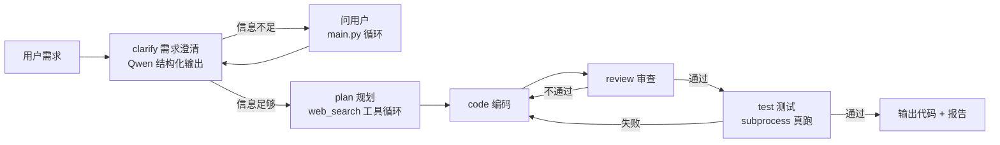

# 多智能体代码开发小队（Multi-Agent Code Development Team）

输入一句自然语言需求，四个 AI 角色（规划 / 编码 / 审查 / 测试）协作产出可运行代码：
需求不明确会主动追问澄清，审查或测试不通过会强制回炉重写，测试用真实运行验证而非 LLM 自评。

## 架构

## 快速开始

1. 安装依赖：`pip install -r requirements.txt`
2. 复制 `.env.example` 为 `.env`，填入自己的 API key（DeepSeek / Qwen / Tavily）
3. 运行：`python main.py`，输入需求（多行粘贴后按一个空行结束）
4. 每次运行的代码与测试产物保存在 `work/<时间戳>/` 目录

## 核心设计决策

- **State 是角色间的数据契约**：每个节点只读写自己负责的显式字段（plan / code / review / test_result），带来可观测性和可扩展性
- **反思循环用条件边实现**：审查/测试不通过 → 强制回编码节点重写，靠显式布尔字段路由，不依赖 prompt 碰运气；`MAX_ATTEMPTS` 硬切断防死循环
- **验证哲学：LLM 写断言，机器判结果**：测试 agent 生成含 assert 的测试文件，subprocess 真跑，退出码 + `ALL TESTS PASSED` 标记判定；无接口可测时明确降级为冒烟测试，不假装通过
- **需求澄清**：Qwen 结构化输出（Pydantic）判定信息是否足够，不足则向用户提问，最多 3 轮
- **LLM 输出消毒**：prompt 禁止 Markdown 代码块 + 落盘前 `strip_code_fences` 双保险，防止生成的 .py 文件语法错误
- **工具调用**：手写 React 循环（`call_model`），plan/code 节点可按需调用 web_search，不依赖黑箱框架

## 目录结构

| 文件 | 职责 |
|---|---|
| `model.py` | DeepSeek 模型构建 |
| `tools.py` | web_search / write_file / run_python_file |
| `react.py` | 通用 LLM+工具循环 |
| `structured.py` | Qwen 结构化输出（需求澄清判定） |
| `prompt.py` | 各角色提示词 |
| `state.py` | State 定义（角色间数据契约） |
| `graph.py` | StateGraph 图结构与节点 |
| `main.py` | 入口：输入、澄清循环、流式输出 |

## 已知限制

- 多行输入会被空行截断（TODO）
- 交互式程序（游戏 / GUI）只能做冒烟测试，无法断言验证
- 记忆层（跨项目经验复用）尚未实现
